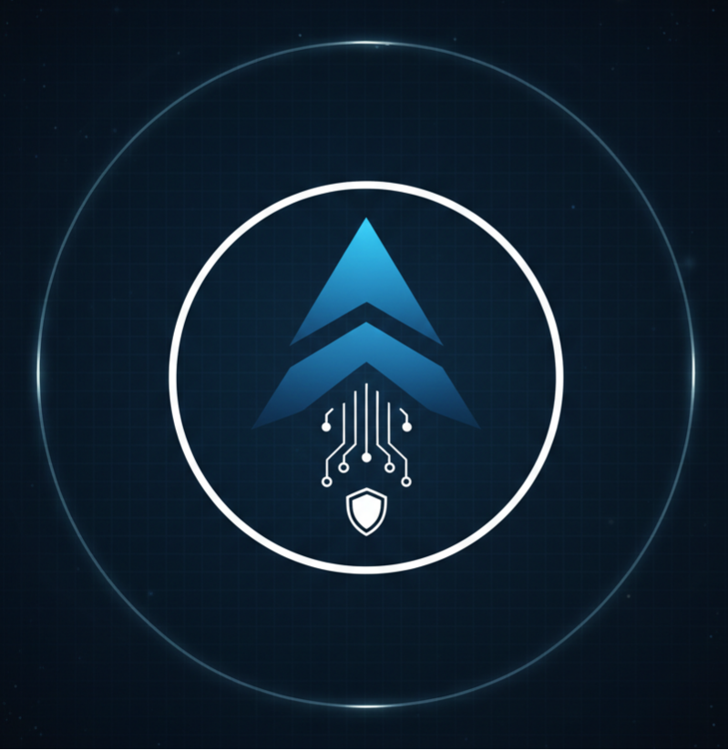

<h1 style="margin-bottom:0;">ARES</h1>
<h3 style="margin-top:0;">Autonomous Reliability Engineering System</h3>

<p>
  <strong>AI‑Driven Detection • Self‑Healing Infrastructure • Production‑Grade DevOps</strong>
</p>

<div align="center">



</div>

---

<p align="center">
  
  
  
  
  
</p>

---

## System Overview

ARES is an **autonomous reliability platform** engineered to monitor, predict, and recover distributed microservices systems without human intervention.  
It merges **DevOps automation**, **observability**, and **machine learning** to convert infrastructure into a **self‑managing control system**.

Traditional Model:
```
Monitoring → Alert → Manual Recovery
```

ARES Model:
```
Telemetry → ML Analysis → Decision Engine → Automated Healing
```

---

## Architectural Model

ARES operates across two independent planes.

### Application Data Plane
The live SaaS microservices application.

| Layer | Components |
|------|------------|
| Frontend | Next.js UI |
| Services | User • Product • Cart • Order |
| Networking | API Gateway • Reverse Proxy |
| Data | PostgreSQL • Redis |
| Runtime | Docker Containers |

### Control Plane — ARES Core
The reliability intelligence system.

| Module | Role |
|-------|------|
| Monitoring Agents | Metric collection |
| Log Agents | Log ingestion & parsing |
| Health Agents | Service heartbeat checks |
| ML Engine | Anomaly detection |
| Healing Engine | Automated remediation |
| Observability Stack | Metrics & visualization |

---

## Observability Stack

ARES maintains continuous telemetry streams.

| Metric | Purpose |
|--------|---------|
| CPU | Load trend analysis |
| Memory | Leak & pressure detection |
| Latency | Performance degradation |
| Error Rate | Failure signals |
| Health | Service uptime |

**Tools:** Prometheus • Grafana • ELK / Loki

---

## Machine Learning Layer

ARES uses **unsupervised anomaly detection**.

| Model | Function |
|------|----------|
| Isolation Forest | Outlier detection |
| Statistical Model | Baseline deviation |

Features analyzed:

- CPU usage trends  
- Memory growth patterns  
- Latency distributions  
- Error frequencies  

Model output feeds the decision engine for automated action.

---

## Autonomous Agent Framework

| Agent | Responsibility |
|------|----------------|
| Monitoring Agent | Metric ingestion |
| Health Agent | Service heartbeat validation |
| Log Agent | Log anomaly signals |
| Healing Agent | Executes remediation |
| Load Agent | Traffic simulation |

Agents operate continuously as background reliability operators.

---

## Self‑Healing Engine

ARES performs targeted automated remediation.

| Failure Condition | Action |
|-------------------|--------|
| Container crash | Restart container |
| CPU overload | Simulated scaling |
| Memory anomaly | Service recycle |
| API timeout | Restart service |

Healing commands executed via Docker Engine API.

---

## CI/CD Pipeline

```
Source Push → Build Containers → Test Suite → Registry Push → Cloud Deployment
```

Ensures reproducible, automated deployment aligned with production DevOps standards.

---

## Reliability Testing

ARES incorporates resilience validation through:

- Load simulation  
- Failure injection  
- Resource stress tests  
- Service disruption experiments  

Inspired by Chaos Engineering principles.

---

## Dashboard

ARES provides a control center displaying:

- Service health overview  
- Resource utilization graphs  
- ML anomaly alerts  
- Recovery timeline  
- Agent activity logs  

---

## Technology Stack

| Domain | Technology |
|--------|-----------|
| Frontend | Next.js, React |
| Backend | Node.js, Python |
| Containers | Docker |
| Cloud | AWS EC2 |
| CI/CD | GitHub Actions |
| Monitoring | Prometheus |
| Visualization | Grafana |
| Logging | ELK / Loki |
| ML | Scikit‑learn |
| Database | PostgreSQL |
| Cache | Redis |

---

## System Impact

ARES represents the evolution from **reactive monitoring systems** to **autonomous reliability platforms**, integrating distributed systems engineering, ML intelligence, and DevOps automation.

---

## Future Expansion

- Kubernetes orchestration  
- Predictive auto‑scaling  
- Advanced ML models  
- Multi‑cloud deployments  

---

## License

Academic Research & Innovation Project

